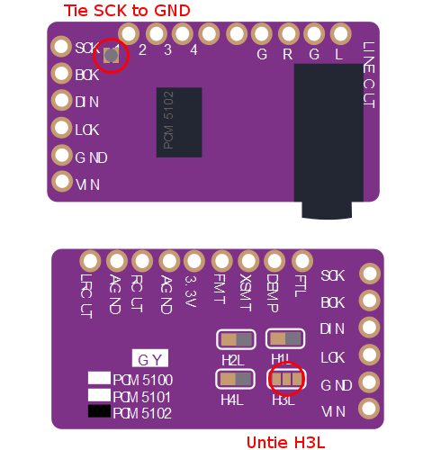

# Teensy 4.0 MP3 Player
## Supported Board and Devices
* Teensy 4.0
* ES9023 24bit I2S Audio DAC
* PCM5102 32bit I2S Audio DAC
* ST7735 1.8" LCD (128x160 pix)
* ST7789 1.3" LCD (240x240 pix) without CS type
* IL9341 2.2" LCD (240x320 pix)

## Features
### Supported
* exFAT MicroSD by SDIO (confirmed up to 1TB UHS-I Speed Class 3 card)
* Sampling Frequency / Bit Resolution / Channel: 44.1KHz 16bit Stereo
* MP3 with ID3 Tag
* WAV with Tag information by LIST chunk
* AAC (m4a) with MP4 Tag
* FLAC with FLAC Tag (Vorbis comment)
* JPEG, PNG Cover Art embedded in Tag (multiple image supported)
* Folder/File navigation by UTF16 with unicode font
* Control by Android Headphone button (3 buttons)
* Volume by utilizing DAC 24bit/32bit range for playing 16bit Audio data
* Album unit random play by time out after play finish (Assuming [Artist Folder]/[Album Folder] structure)
* Resume playback
* Battery voltage check (Optional: external circuit needed)

### Not supported
* Progressive JPEG Cover Art
* Fast Forward / Fast Rewind
* Gapless playback

## Board Configuration
* Edit [board_conf.h](include/board_conf.h) to choose your board

## Pin Assignment
In addition to original connection

| Teensy4.0 Pin | Function | Connection |
----|----|----
| 7 | OUT1A | to ES9023 SDI (3) / to PCM5102 DIN (14) |
| 8 | GPIO | to LCD DC |
| 9 | GPIO | to LCD RST |
| 10 | CS | to LCD CS |
| 11 | MOSI | to LCD MOSI |
| 13 | SCK | to LCD SCK |
| 14 | A0 | from Battery Voltage |
| 15 | GPIO | to LCD Backlight control (Optional) | 
| 16 | GPIO | to Power Keep (DC/DC) |
| 18 | GPIO | to Battery Check |
| 20 | LRCLK1 | to ES9023 LRCK (2) / to PCM5102 LRCK (15) |
| 21 | BCLK1 | to ES9023 BCK (1) / to PCM5102 BCK (13) | 
| 22 | A8 | from Android Head Phone MIC (Button) |
| 23 | MCLK | to ES9023 MCLK (13) |
| 34 | DAT1 | from/to microSD DAT1 |
| 35 | DAT0 | from/to microSD DAT0 |
| 36 | CLK | to microSD CLK |
| 37 | CMD | from/to microSD CMD |
| 38 | DAT3 | from/to microSD DAT3 |
| 39 | DAT2 | from/to microSD DAT2 |

## I2S DAC
Both ES9023 and PCM5102 are supported without selection.
### PCM5102 Board Setting
tie PCM5102 SCK (12) to low 
open H3L

## LCD

## microSD
Several ways to mount microSD connector.
Please set SDIO_CTL_PAD_DSE_VAL in platformio.ini depending by connection situation.
* Hinged type microSD connector (isEasy: B, IO-Timing: A, isSmart: B, SDIO_CTL_PAD_DSE_VAL: 1)
* Flexible cable (isEasy: C, IO-Timing: B, isSmart: A, SDIO_CTL_PAD_DSE_VAL: 1~2)
* SD Card connector (isEasy: A, IO-Timing: C, isSmart: C, SDIO_CTL_PAD_DSE_VAL: 2~4)
It is recommended to check if stable access is achievable in advance at SdInfo and bench projects in SdFat library folder at Arduino environment.

## Button Control Guide
Connect MIC pin of Android headphone remote control with 3 buttons to A8 pin of Teensy 4.0
PA0 also needs to be pulled-up by 2.2Kohm from 3.3V. See schematic for detail.

### FileView Mode
* Up/Down button to go up/down for file selection
* Center 1 click to get into the folder
* Center 1 click to play WAV file (go to Play Mode)
* Center 2 click to go parent folder
* Center 3 click to random album play (go to Play Mode)

### Play Mode
* Up/Down button for volume up/down
* Center 1 click to pause/play
* Center 2 click to stop (go back to FileView Mode)
* Center 3 click to random album play

### Power On/Off (Optional: external circuit needed)
* Long push Center button

## Unicode Font
Place resouce/unifont.bin on microSD root folder

## Schematic
[xxxx.pdf](xxxx.pdf)

## Prototype Example
