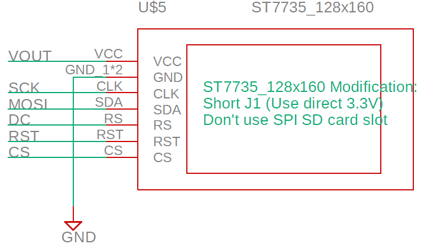
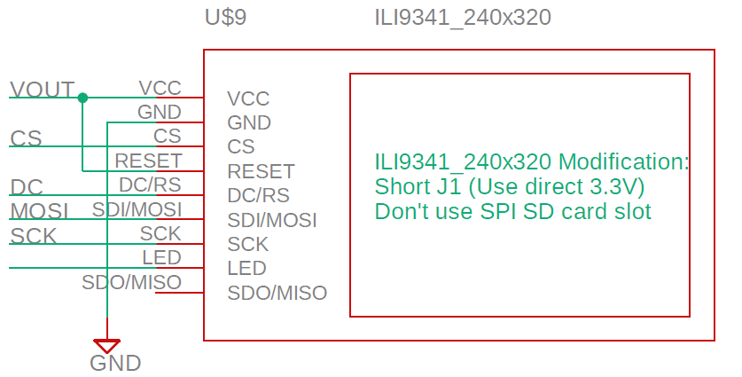
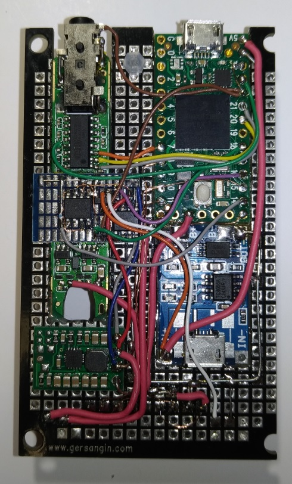
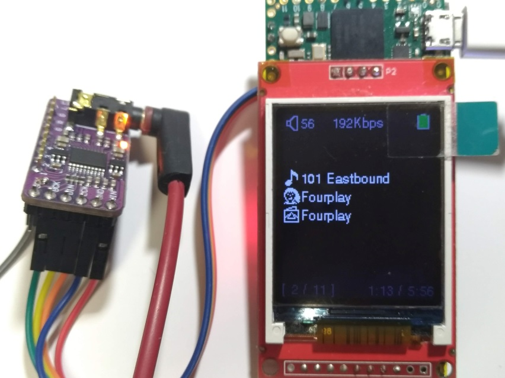

# Teensy 4.0 MP3 Player


[](https://github.com/elehobica/Teensy40_MP3_Player/actions/workflows/build.yml)

## Features
* Supported audio codec
  * MP3: 16bit / 44.1KHz, 48KHz
  * AAC: 16bit / 44.1KHz, 48KHz
  * WAV: 16bit, 24bit / 44.1KHz, 48KHz, 88.2KHz, 96KHz, 176.4KHz, 192KHz
  * FLAC: 16bit, 24bit / 44.1KHz, 48KHz, 88.2KHz, 96KHz, 176.4KHz, 192KHz
* Supported tag
  * ID3/ID3v2.2/ID3v2.3/ID3v2.4 tag for MP3, WAV
  * MP4 tag for AAC (m4a)
  * LIST chunk for WAV
  * FLAC tag (Vorbis comment) for FLAC
  * JPEG, PNG Cover Art embedded in Tag (multiple images supported)
* Audio output to I2S DAC and/or S/PDIF (Toslink)
* exFAT format microSD by SDIO (confirmed up to 1TB UHS-I Speed Class 3 card)
* Sorted folder/File navigation by UTF16 with unicode font
* User Interface by Android Headphone button (3 buttons)
* Volume Control by utilizing DAC 24bit/32bit range for playing 16bit Audio data
* Album unit Sequential/Repeat/Random play by time out when play finished (Assuming [Artist Folder]/[Album Folder] structure)
* Resume playback
* Battery voltage check (Optional: external circuit needed)

### Note
* Progressive JPEG Cover Art not supported
* Fast Forward / Fast Rewind not supported
* Gapless playback not supported

## Supported Board and Peripheral Devices
### Main board
* Teensy 4.0
### LCD module
* ST7789 1.3" LCD (240x240 pix) without CS type
* IL9341 2.2" LCD (240x320 pix)
* ST7735 1.8" LCD (128x160 pix)
### I2S DAC
* ES9023 24bit I2S Audio DAC
* PCM5102 32bit I2S Audio DAC
### S/PDIF Tx (Optional)
* DLT1160A-T-1 (or equivalent module)

## Pin Assignment
In addition to original connection

| Teensy4.0 Pin | Function | Connection |
----|----|----
| 2 | OUT2 | to S/PDIF Tx |
| 3 | GPIO | to S/PDIF Power |
| 6 | GPIO | to ES9023 MUTE_B (15) / to PCM5102 XSMT (17) |
| 7 | OUT1A | to ES9023 SDI (3) / to PCM5102 DIN (14) |
| 8 | GPIO | to LCD DC |
| 9 | GPIO | to LCD RST |
| 10 | CS | to LCD CS |
| 11 | MOSI | to LCD MOSI |
| 13 | SCK | to LCD SCK |
| 14 | A0 | from Battery Voltage |
| 15 | GPIO | to LCD Backlight control (Optional) | 
| 16 | GPIO | to Power Keep (DC/DC) |
| 18 | GPIO | to Battery Check |
| 20 | LRCLK1 | to ES9023 LRCK (2) / to PCM5102 LRCK (15) |
| 21 | BCLK1 | to ES9024 BCK (1) / to PCM5102 BCK (13) | 
| 22 | A8 | from Android Head Phone MIC (Button) |
| 23 | MCLK | to ES9023 MCLK (13) |
| 34 | DAT1 | from/to microSD DAT1 |
| 35 | DAT0 | from/to microSD DAT0 |
| 36 | CLK | to microSD CLK |
| 37 | CMD | from/to microSD CMD |
| 38 | DAT3 | from/to microSD DAT3 |
| 39 | DAT2 | from/to microSD DAT3 |

tie PCM5102 SCK (12) to low

## Schematic
[Teensy40_MP3_Player_schematic.pdf](doc/Teensy40_MP3_Player_schematic.pdf)

## I2S DAC
Both ES9023 and PCM5102 are supported without code definition change.
### PCM5102 Board Setting
* tie PCM5102 SCK (12) to low
* open H3L


## LCD Module
* ST7735 1.8" LCD (128x160 pix)
 
* ST7789 1.3" LCD (240x240 pix) without CS type
 
* IL9341 2.2" LCD (240x320 pix)
 

## microSD
### Drive strength configuration for SDIO
Please set SDIO_CTL_PAD_DSE_VAL in [platformio.ini](platformio.ini) depending by microSD Card connection condition.

* Direct Connection on Teensy 4.0 Board such as Hinged type microSD connector: SDIO_CTL_PAD_DSE_VAL = 1
* Connect through Flexible cable less than 5cm: SDIO_CTL_PAD_DSE_VAL = 1~2
* With longer cable and/or more load than above cases: SDIO_CTL_PAD_DSE_VAL = 2~4

It is recommended to check microSD access stability in advance by [SdInfo](lib/SdFat/examples/SdInfo) and [bench](lib/SdFat/examples/bench) projects with Arduino environment.

### Confirmed microSD Cards
* SanDisk microSDXC Ultra A1 64GB (UHS-I Speed-class 1)
* SanDisk microSDXC Ultra A1 512GB (UHS-I Speed-class 1)
* SanDisk microSDXC Extreme A2 1TB (UHS-I Speed-class 3)

## Unicode Font File
Place [resource/unifont.bin](resource/unifont.bin) on microSD root folder

## How to build
Build using Docker image (recommended):
```
docker run --rm -v $(pwd):/project -w /project elehobica/teensy40-docker:1.0.0 pio run -e ST7789_240x240
```

Select your LCD type by specifying the PlatformIO environment variable with `-e`:
| Environment | LCD Module |
|---|---|
| `ST7735_128x160` | 1.8" ST7735 128x160 |
| `ST7789_240x240` | 1.3" ST7789 240x240 |
| `ILI9341_240x320` | 2.2" ILI9341 240x320 |

Alternatively, install [Visual Studio Code](https://code.visualstudio.com/) with the PlatformIO IDE extension and select the environment from the status bar.

## How to upload firmware
You can upload a pre-built firmware.hex (e.g. from [Releases](https://github.com/elehobica/Teensy40_MP3_Player/releases) or CI artifacts) using [Teensy Loader CLI](https://github.com/PaulStoffregen/teensy_loader_cli).

```
teensy_loader_cli --mcu=TEENSY40 -wvs firmware-xxx.hex
```

* Press the button on Teensy 4.0 board to enter bootloader mode before running the command, or use `-s` option to wait for a soft reboot
* Teensy Loader CLI is also bundled in PlatformIO package at `~/.platformio/packages/tool-teensy/teensy_loader_cli`
* Alternatively, [Teensy Loader](https://www.pjrc.com/teensy/loader.html) (GUI application) can be used to open and upload .hex files

## Button Control Guide
Connect MIC pin of Android headphone remote control with 3 buttons to A8 pin of Teensy 4.0.
A8 also needs to be pulled-up by 2.2Kohm from 3.3V. See schematic for detail.

### FileView Mode
* Up/Down button to go up/down for file selection
* Center 1 click to get into the folder
* Center 1 click to play WAV file (go to Play Mode)
* Center 2 clicks to go parent folder
* Center 3 clicks to Random album play (go to Play Mode)
* Long push Center button to go to Config Mode
* 1 min passed without any button: Sequential/SequentialRepeat/Repeat/Random album play (go to Play Mode)

### Play Mode
* Up/Down button for volume up/down
* Center 1 click to pause/play
* Center 2 clicks to stop (go back to FileView Mode)
* Center 3 clicks to Random album play
* Long push Center button to go to Config Mode

### Config Mode
* Up/Down button to go up/down to select config items
* Center 1 click to determine config values
* Center 2 clicks to go back to previous Mode (FileView or Play)
* Long push to Power Off (Optional: external circuit needed)

### Power On (Optional: external circuit needed)
* Long push Center button

## Prototype Example


* with ST7789_240x240_WOCS and ES9023

  

* with ILI9341_240x320 and ES9023

 

* with ST7735_128x160 and ES9023

  

* with ST7735_128x160 and PCM5102

 
